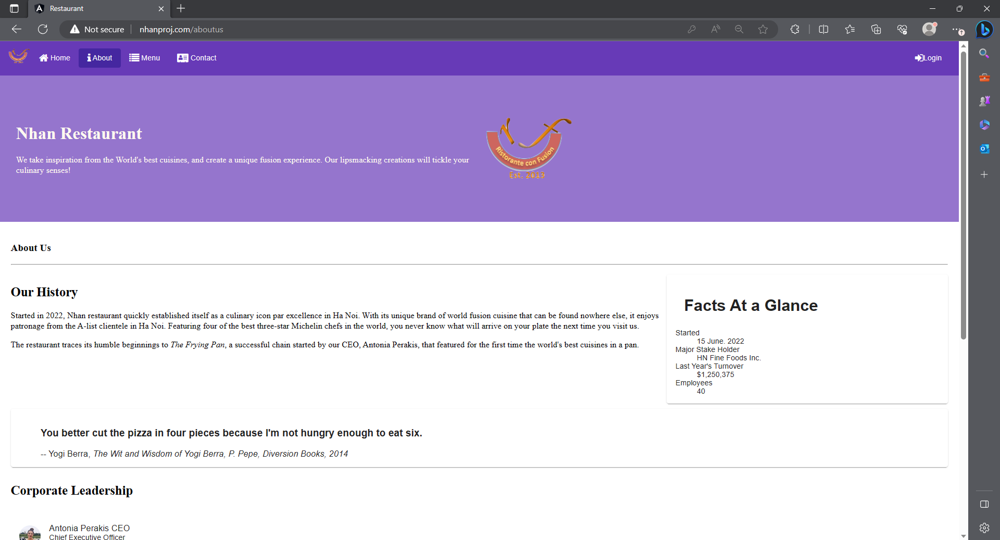
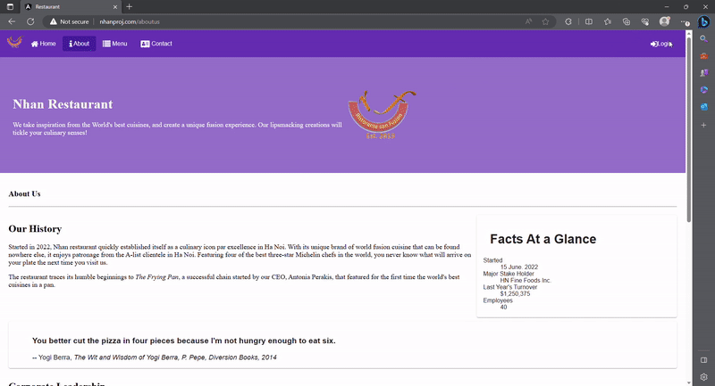

# Restaurant

## Table of content
- [Introduction](#introduction)
- [Learning Objectives](#learning-objectives)
- [Link to Web App](#link-to-web-app)
- [Site Feature](#site-feature)
- [Technology](#technology)

## Introduction
Restaurant is a single-page web application that features a variety of dishes I've personally cooked. It also contains additional dummy data to simulate a full-scale restaurant website.

## Learning Objectives
This project was primarily aimed at immersing myself in the realm of web app development, particularly getting practical experience with the Angular framework. It also serves as an opportunity for me to apply my networking knowledge, manage my own domain name, and navigate the process of deploying my web application to a production environment using AWS EC2.

## Link to Web App
http://nhanproj.com/

## Site Feature
### Homepage

### Menu

### Login form

## Technology
- Angular 13.3.8
- TypeScript 4.6.2
- SCSS
- HTML5
- AWS EC2